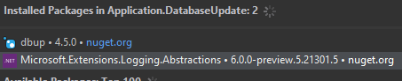
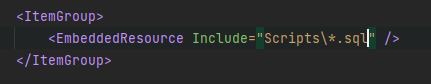

# Database Migrations
```
Search for the tag [DB] to help find related areas of the project
```
### Setup
```
https://dbup.readthedocs.io/en/latest/
```
1. Install nuget package.

   
2. Register database updater in IoC.
2. Setup project to auto embed scripts ".csproj".
   
   
2. Configure DbUp.
   - Where to find the scripts.
   - Where we store the scripts that have been run.
3. Create database update Middleware.
4. Register database update middleware so database gets updated on startup.

