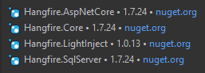

#Hangfire
```
Search for the tag [HF] to help find related areas of the project
```
A package to enable background task processing for the application. Each presentation project can become a 
hangfire server which are used to run the tasks. Web projects can also optionally enable a dashboard to allow 
easier management of tasks.

### Setup
Create a database that you which to use for hangfire. No need to create any tables this will be done the first 
time you run the application. This guide assumes you are using a SQL database.

### .Net Core application setup
```
https://docs.hangfire.io/en/latest/getting-started/aspnet-core-applications.html
```
1. Install nuget packages
   
   
2. Add Hangfire connection string to appsettings.json
3. Register Hangfire configuration in startup.cs
    ```
    If using LIght Inject, ensure that you include the light inject activator
    .UseLightInjectActivator(HangfireIoC.BackgroundTaskServiceContainer())
    ```
4. Register App as hangfire server in startup.cs
5. (Optional) Enable hangfire dashboard in startup.cs
6. Manage IoC in Application.IoC/CompositionRoot.cs & Application.IoC/HangfireIoC.cs

### .Net Framework application setup
```
https://docs.hangfire.io/en/latest/getting-started/aspnet-applications.html
```