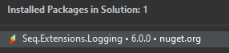

# Logging
```
Search for the tag [LG] to help find related areas of the project
```
| Level | Description |
| ----- | ----------- |
| Trace | Really low level logging. Only required when developing and solving issues. Should never be turned on in production. |
| Debug | Log relevant to development, usually they surface more detail information then is usually required to under stand application flow. |
| Information | Use to log the application flow. i.e. What the application is doing. |
| Warning | Use this for handled errors. |
| Error | Unhandled errors and urgent problems. Think! Do i need to drop everything and fix this? |

## Seq
```
Search for the tag [SQ] to help find related areas of the project
```

### Local Installation
Download and install Seq.
```
https://datalust.co/download
```  
### .Net Core Application Setup
1. Create an api key for the application in Seq settings.
2. Install seq nuget package.


3. Add Seq configuration to "appsettings.json".
4. Add Seq to logging configuration in "Startup.cs".