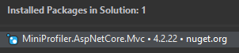
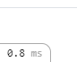

# Mini Profiler
```
Search for the tag [MP] to help find related areas of the project
```

### Setup
```
https://miniprofiler.com/dotnet/AspDotNetCore
```
1. Install mini profiler nuget package

    
2. Register Mini profiler configuration in "startup.cs".
3. Enable miniprofiler when in development environment via "startup.cs".
3. Add tag helpers to "_viewImports.cshtml"
4. Add mini profiler tag to layout.
5. If setup correctly you should see something to similar to:
   
   